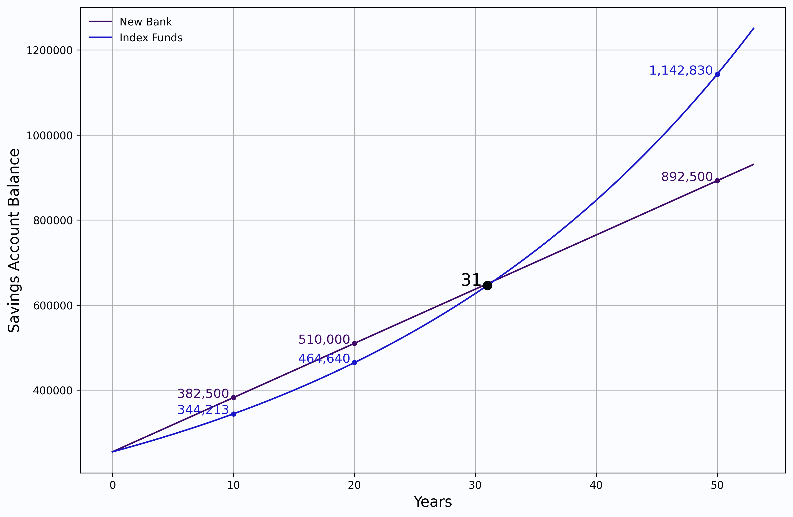

# If-I-had-a-Million-Dollars
A code for rendering graph for my school project, "If I had a million dollars."

<p align="left">
  
</p>

---

This is a simple Python script that uses matplotlib to render a graph for my school project, "If I had a million dollars."
This project is about having the option to buy items and make investments and tracking the value of your purchases and investments over time.

### Setup
1. Install Python 3.9.x
2. Install matplotlib (`pip install matplotlib`)
3. Install numpy (`pip install numpy`)
4. Run the script (`python investment.py` or `python compare.py`)

### How it works

`investment.py` is the script that renders the graph that compares the profit of investing in a savings account, bonds, and index funds. Below is the code that calculates the profit of each investment.

```python
principal = 255000 # initial investment
year = np.arange(0, 54)

savings_account = principal * (1 + 0.015) ** year
bonds = principal * (1 + (0.02 / 4)) ** (year * 4)
index_funds = principal * math.e ** (0.03 * year)
```

`compare.py` is the script that renders the graph that compares the profit of investing in a index funds and new bank. Below is the code that calculates the profit of each investment.

```python
principal = 255000 # initial investment
year = np.arange(0, 54)

index_funds = principal * math.e ** (0.03 * year)
new_bank = principal * (1 + 0.05 * year)
```